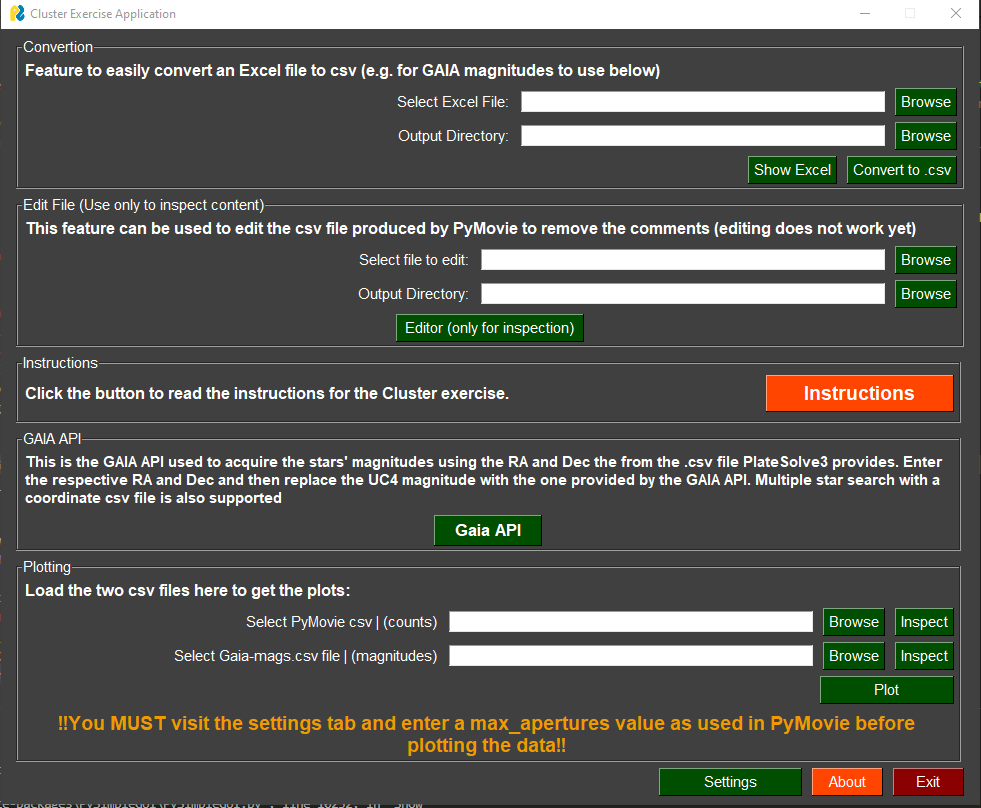

# PyCluster #
This is an application created to facilitate the analysis required for the Open Cluster laboratory exercice in "Observational Astrnomy" course.
The application includes a built-in Instructions manual that can be consulted for advice regarding the required steps.

A more detailed guide of how to use the application can be found in my thesis [here.](https://ikee.lib.auth.gr/record/347145/files/grivas.pdf)

## Preview ##

## Installation ##
For the installation of the application you must download the PyCluster folder. Then the application can be started by double-clicking the cluster_app.py file.
To download the folder navigate to the green "<>Code" button at the top right and then "Download zip".

Notice that initially the application may take a few moments to start!

A set of example files that can be used to experiment with the application's features are also provided and refer to the M7 open cluster. These example files 
include the magnitude coordinates files that can be used to acquire the magnitudes of the stars through GAIA, the photometric analysis of the cluster by PyMovie and
the extracted magnitudes of the stars.

## Requirements ##
In order for the application to operate the following libraries must be installed:

* Matplotlib
* numpy
* pandas
* astropy
* PySimpleGUI

For easier package management the installation of Python through Anaconda is recommended. This includes most of the required packages for the application
and therefore only the installation of PySimpleGUI package is required by the user.

## Contact ##
For any issue do not hesitate to contact me at grivas.grigoris@gmail.com
